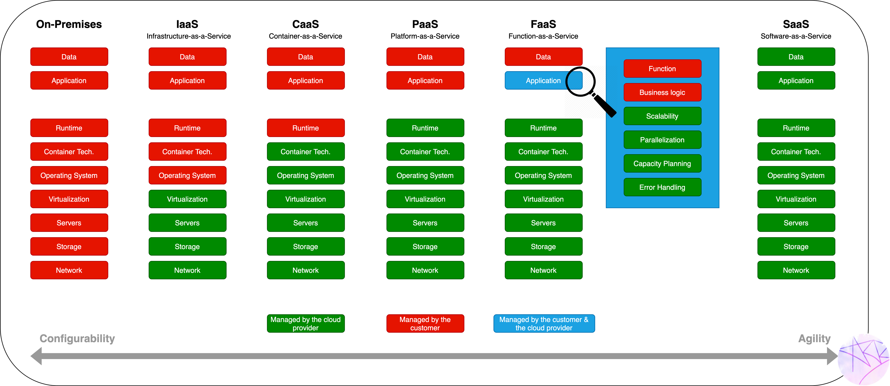

# KN10: Kostenberechnung

## Kostenrechnung IAAS - Rehosting

AWS Kosten

Azure Kosten

Die Hardware sind entweder gleich oder höher ausgewählt als der Spezifikationen, um die Leistung gleich zu halten.

Beider Anbieter haben begrenzt oder gar keine Information zur Backups, also wird diese nur mit berechnet wenn es zur Verfügung steht.

## Kostenrechnung PAAS - Replattforming

Heroku hat vier haupt Möglichkeiten, mit einige zusätzliche Anpassungen. 

Für der Webserver und DB Server ist der Performace Dyno (Container) geeignet, da der der Standard Dyno nicht genug RAM hat für beide Servers.

Mit der Standard-M Dyno Type kann man bis zur 8 Dynos gleichzeitig betreiben. Dabei sind nur 2 nötig (Webserver und DB Server).

## Kostenrechnung SAAS - Repurchasing

Für beide Anbieter wurde der Professional Angebot gewählt.

Zoho CRM Kosten

SalesForce Sales Cloud Kosten

Hier ist es recht klar, da der Zoho jährlich pro Benützer nur 23 Euro kostet, im Vergleich zur 100 Dollar pro Benützer.

## Interpretation der Resultat

### Kosten
Beachten Sie auch mögliche Kosten, die nicht in den Kalkulatoren abgedeckt sind. Wieso sind die Kosten unterschiedlich? Sind die Unterschiede gerechtfertigt?

Die Kosten sind abhängig, von viele Resourcen und Systeme der Anbieter verwalten muss.

Als Beispiel muss man bei IaaS die Containers, Instanzen, und Applikation selber pflegen, dafür bezählt viel weniger im Vergeich zur andere Services wie FaaS und SaaS.

Die selber Pflegung diese Resourcen und Systemen sind auch Kosten, die mit Berechnet muss, bevor man sich für ein IaaS Anbieter entscheidet. Es braucht auch zusätzliche Arbeieter, die sich mit solche Systeme auseinandersetzen können.

Bei SaaS wird der Applikation komplett von der Anbieter gepflegt und verwaltet. Aufgrund diese wird der Preis anders behandelt. Man zählt also pro Benützer pro Monat / Jahr, um der Software zu verwenden. Dieses kostet jedoch sehr viel.

Die Abbildung unten zeigt die Unterschiede am Besten.

### Aufwand für Ihre Firma
Welche Arbeit müssten Sie als Firma in die verschiedenen Migrationsvarianten investieren.

Dies hängt vor allem davon ab, ob die zugrunde liegenden Systeme, die der Dienst bereitstellt, mit den zu migrierenden Systemen und Ressourcen kompatibel sind.

Sollte das nicht der Fall sein, muss man viel Arbeit leisten, um der Migration durchzuführen.

Refactoring ist die aufwendigste davon.

Im Gegenteil, Repurchasing, also mit SaaS, ist am einfachste, da man praktisch nichts migrieren muss. Es wird alles von der Anbieter behandelt.